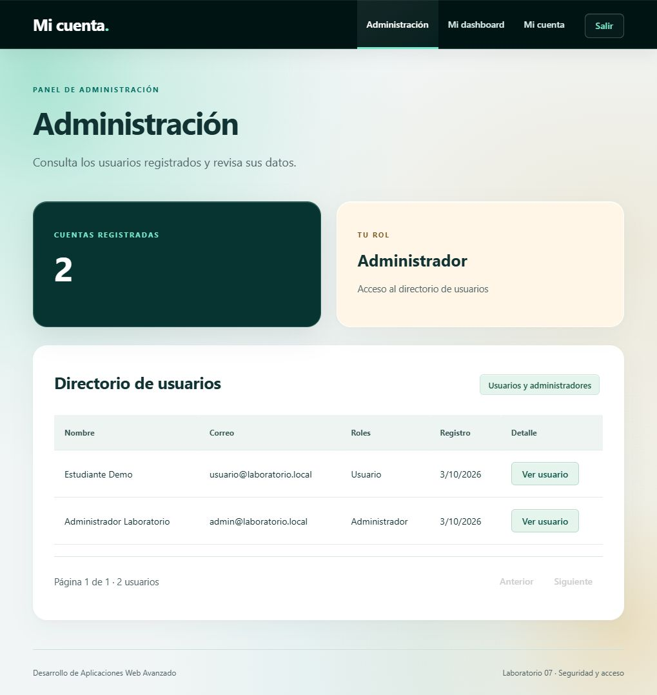
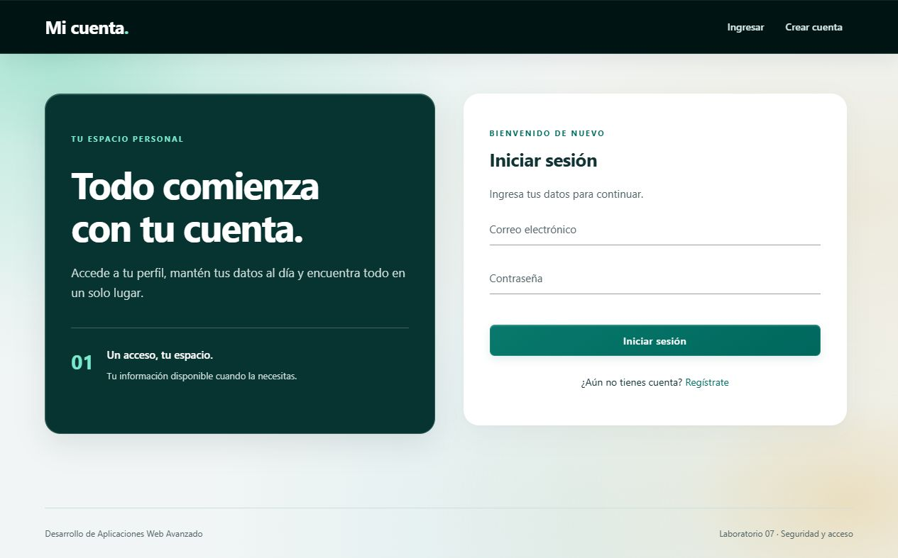
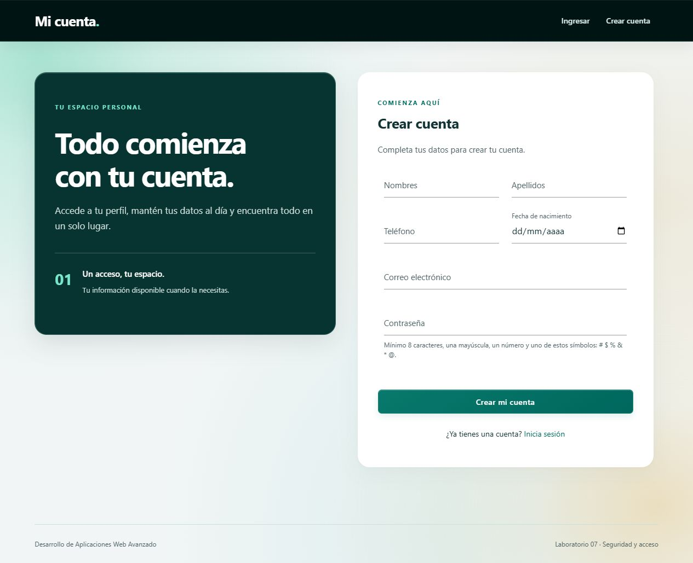
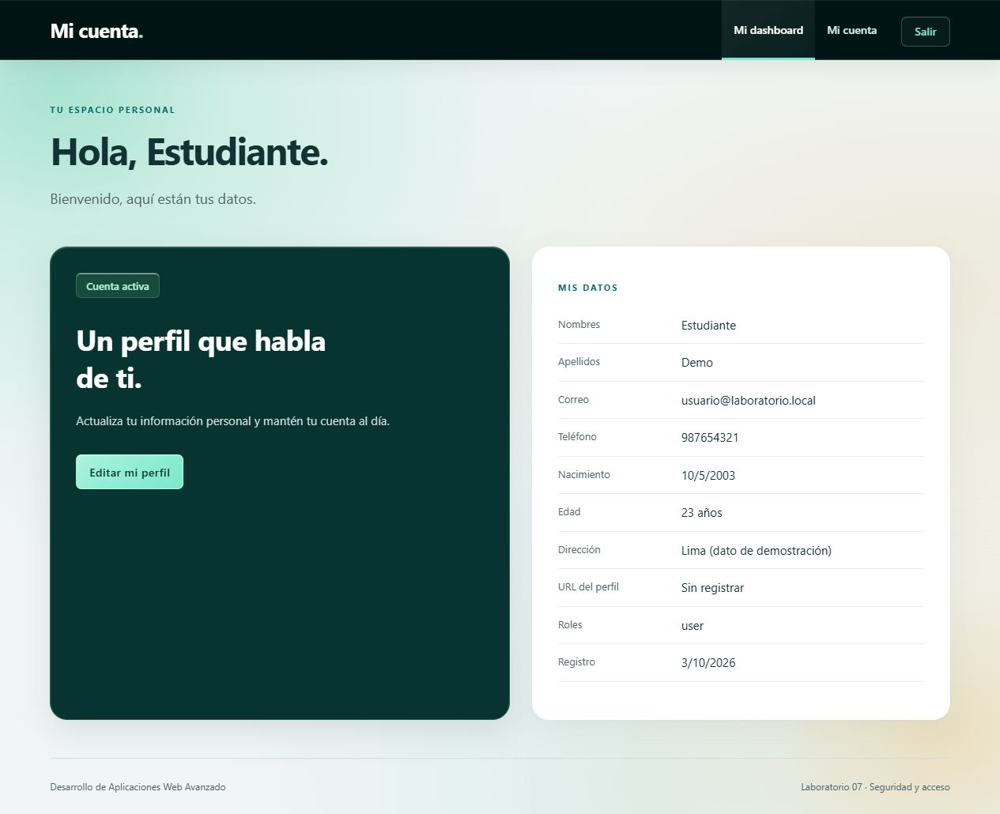
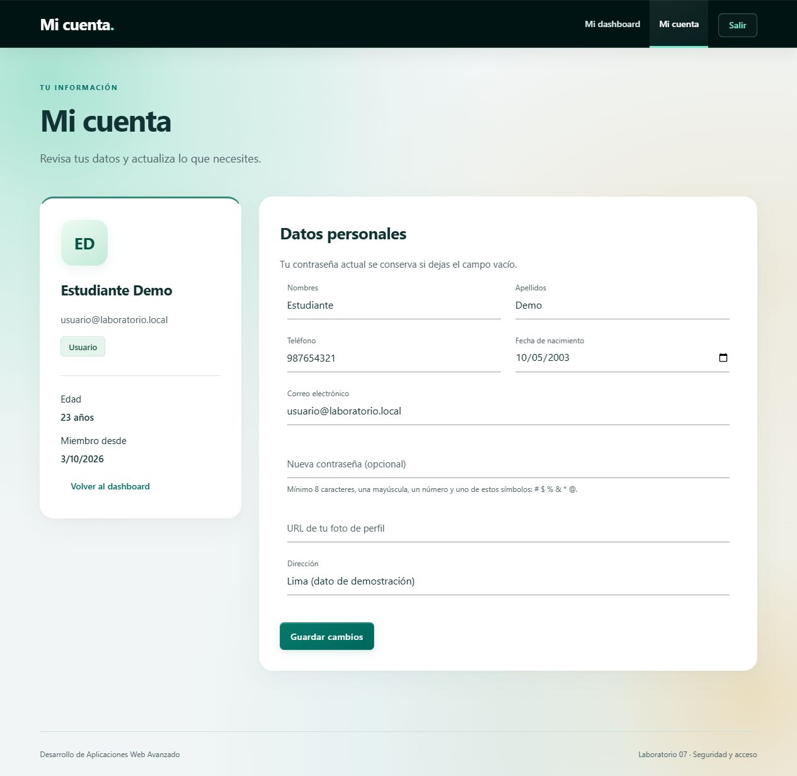
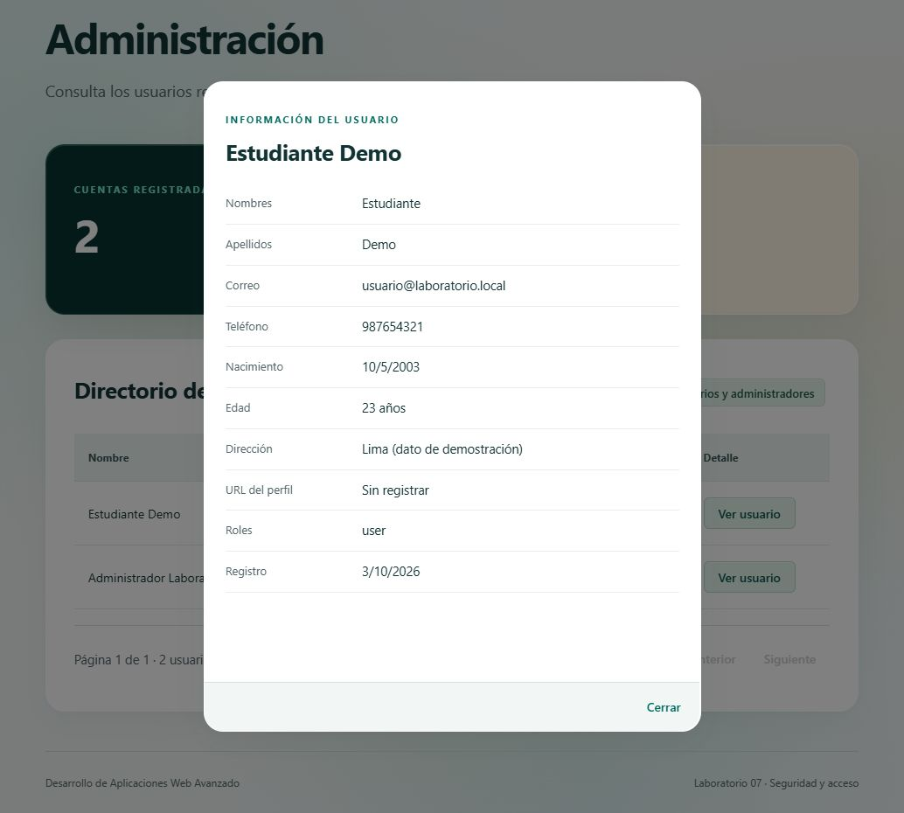

# Mi cuenta · Express, MongoDB y JWT

Aplicación web del Laboratorio 07 de Desarrollo de Aplicaciones Web Avanzado. Incluye registro, autenticación, perfil editable y dashboards por rol, con un diseño Liquid Glass y luces animadas.



## Tecnologías

| Tecnología | Uso |
|---|---|
| Node.js 22 y módulos ES | Ejecución del servidor y organización del código |
| Express 4 | Rutas HTTP, middlewares y API REST |
| MongoDB y Mongoose 7 | Persistencia, validaciones, relaciones e índices |
| EJS | Vistas renderizadas en el servidor |
| Materialize CSS 1.0 | Formularios, tablas, botones y ventanas de detalle |
| JavaScript, Fetch API y sessionStorage | Interacción del cliente y peticiones autenticadas |
| JSON Web Token | Identificación y vencimiento de sesiones |
| bcrypt 6 | Hash de contraseñas |
| dotenv y cookie-parser | Configuración y cookie de navegación |
| nodemon 3 y node:test | Recarga en desarrollo y pruebas automatizadas |

## Requisitos

- Node.js 22 y npm.
- MongoDB Server en funcionamiento, local o remoto.
- Git para clonar el repositorio.
- MongoDB Compass es opcional: sirve para consultar la base, pero no reemplaza al servidor.

## Instalación

```bash
git clone https://github.com/C5-PHO/DAWA-S7.git
cd DAWA-S7
npm ci
```

Crea tu configuración local **solo si aún no tienes `.env`**.

En PowerShell:

```powershell
Copy-Item .env.example .env
```

En Linux o macOS:

```bash
cp .env.example .env
```

Edita `.env`, configura `MONGODB_URI` y sustituye `JWT_SECRET` por una clave propia. Puedes generar una con:

```bash
node -e "console.log(require('node:crypto').randomBytes(32).toString('hex'))"
```

Para crear un administrador al arrancar, configura `ADMIN_EMAIL` y `ADMIN_PASSWORD`. La contraseña debe cumplir las reglas del registro y estar entre comillas si contiene `#`.

```dotenv
ADMIN_EMAIL=tu-admin@example.com
ADMIN_PASSWORD="Tu contraseña válida aquí"
```

El ejemplo anterior es un marcador: reemplázalo por tu contraseña. El administrador se crea solo si ese correo no existe; el arranque no cambia la contraseña ni promueve cuentas existentes.

## Configuración

| Variable | Descripción | Valor de ejemplo |
|---|---|---|
| `PORT` | Puerto HTTP | `3000` |
| `NODE_ENV` | Entorno de ejecución | `development` |
| `MONGODB_URI` | Conexión y nombre de la base | `mongodb://127.0.0.1:27017/auth_db` |
| `JWT_SECRET` | Clave privada para firmar tokens | Generada localmente |
| `JWT_EXPIRES_IN` | Duración de la sesión | `1h` |
| `BCRYPT_SALT_ROUNDS` | Costo del hash, entre 4 y 16 | `10` |
| `ADMIN_EMAIL` | Correo del administrador inicial | Tu correo de administrador |
| `ADMIN_PASSWORD` | Contraseña del administrador inicial | Vacía hasta configurarla |
| `CORS_ORIGIN` | Otros orígenes autorizados, separados por comas | Vacío para la web del mismo servidor |

`.env`, `node_modules` y los datos locales de MongoDB están excluidos de Git.

## Ejecutar el proyecto

Primero inicia MongoDB. Después:

```bash
npm run dev
```

Abre [http://localhost:3000/signIn](http://localhost:3000/signIn).

| Comando | Función |
|---|---|
| `npm ci` | Instalar las versiones del archivo de bloqueo |
| `npm run dev` | Servidor con recarga de JS, EJS y CSS |
| `npm start` | Ejecutar sin nodemon |
| `npm test` | Ejecutar las pruebas |
| `npm run mongo` | Iniciar la instalación portable de MongoDB configurada en Windows |

`npm run mongo` es opcional y específico de Windows: busca `mongod.exe` en `%LOCALAPPDATA%\Programs\MongoDB` y guarda los datos en `.mongodb/data`. No instala MongoDB y no hace falta cuando el servidor ya está funcionando como servicio.

## Cómo usar la aplicación

1. Abre **Crear cuenta** y completa nombres, apellidos, teléfono, fecha de nacimiento, email y contraseña.
2. La contraseña requiere ocho caracteres como mínimo, una mayúscula, un número y uno de estos símbolos: `# $ % & * @`.
3. El registro asigna automáticamente el rol `user` y te devuelve al inicio de sesión.
4. Inicia sesión: los usuarios entran a su dashboard y los administradores al directorio.
5. En **Mi cuenta**, modifica tus datos, dirección o URL del perfil. La contraseña solo cambia si escribes una nueva.
6. En **Administración**, consulta las cuentas mediante páginas de diez registros y pulsa **Ver usuario** para abrir el detalle.
7. Usa **Salir** para cerrar la sesión. Una sesión caducada también devuelve al formulario de ingreso.

Los datos de las capturas son ficticios. Las contraseñas de demostración y los secretos del entorno no forman parte del repositorio.

## Estructura y crecimiento

```text
src/
├── app.js                  # Configura Express sin abrir conexiones ni puertos
├── server.js               # Arranque y cierre del servidor
├── config/                 # Variables de entorno y conexión a MongoDB
├── controllers/            # Entrada y salida de las peticiones HTTP
├── middlewares/            # Autenticación, autorización y manejo de errores
├── models/                 # Esquemas, relaciones e índices
├── repositories/           # Consultas a MongoDB
├── routes/                 # Rutas de API y páginas
├── services/               # Reglas de negocio
├── utils/                  # Validaciones, representación de usuarios y seeds
├── public/                 # JavaScript y estilos del navegador
└── views/                  # Plantillas EJS y componentes compartidos
scripts/                    # Ayuda para iniciar MongoDB en Windows
tests/                      # Pruebas de configuración y flujos de cuentas
docs/screenshots/           # Capturas reales utilizadas por este README
```

La configuración se valida antes del arranque. Express se construye en `createApp`, mientras que `server.js` conecta MongoDB, prepara los datos iniciales y abre HTTP. Las señales SIGINT/SIGTERM solicitan el cierre de las conexiones.

El directorio realiza consultas paginadas, excluye contraseñas desde la consulta y usa un índice compuesto por `createdAt` e `_id` para su ordenación. La preparación de roles completa también bases parcialmente inicializadas.

Para añadir un módulo, crea su modelo y repositorio, coloca las reglas en un servicio, expón las operaciones mediante un controlador y monta sus rutas en `app.js`. Añade pruebas antes de integrarlo con la interfaz.

Estas mejoras facilitan el crecimiento y el mantenimiento; no equivalen a un despliegue distribuido. Para volúmenes grandes, evaluar paginación por cursor, índices según las consultas y pruebas de carga.

## Autenticación y permisos

El cliente guarda el JWT en `sessionStorage` y envía `Authorization: Bearer <token>` a la API. Una cookie HttpOnly permite validar las navegaciones hacia páginas EJS, ya que esas navegaciones no envían automáticamente el contenido de sessionStorage.

La cookie utiliza SameSite=Lax y Secure en producción. Los middlewares verifican la firma, el vencimiento y los roles en el servidor. El cliente también comprueba la expiración y programa el cierre de sesión.

Las contraseñas se validan antes de aplicar bcrypt. Los perfiles y el directorio nunca devuelven hashes de contraseña; editar una cuenta no permite cambiar sus roles.

## Rutas

| Página | Ruta | Acceso |
|---|---|---|
| Inicio de sesión | `/signIn` | Público |
| Registro | `/signUp` | Público |
| Perfil | `/profile` | Autenticado |
| Dashboard de usuario | `/dashboard/user` | `user` o `admin` |
| Administración | `/dashboard/admin` | `admin` |
| Acceso denegado | `/403` | Autenticado |
| Página inexistente | Cualquier ruta no definida | HTTP 404 |

| API | Método | Acceso |
|---|---|---|
| `/api/auth/signUp` | POST | Público |
| `/api/auth/signIn` | POST | Público |
| `/api/auth/signOut` | POST | Público |
| `/api/users/me` | GET, PATCH | Autenticado |
| `/api/users?page=1&limit=10` | GET | `admin` |
| `/api/users/:id` | GET | `admin` |
| `/health` | GET | Estado HTTP de la aplicación |

El directorio devuelve un objeto con `users` y `pagination`, en lugar de un arreglo completo. `page` acepta valores de 1 a 10000 y `limit` de 1 a 50.

```json
{
  "users": [],
  "pagination": { "page": 1, "limit": 10, "total": 0, "totalPages": 1 }
}
```

Se utilizan `phoneNumber` y `address` consistentemente en el proyecto; las variantes `phoneNumer` y `adress` de la guía se interpretaron como errores tipográficos.

## Pruebas

Con MongoDB activo:

```bash
npm test
```

Las pruebas de integración levantan otro servidor en un puerto libre y usan una base temporal `auth_lab_test_*`, que eliminan al finalizar. No modifican `auth_db`.

Se comprueban configuración, validaciones, fechas imposibles, registro y email duplicado, contraseñas incorrectas, perfil y cambio de contraseña, permisos de usuario y administrador, paginación, tokens caducados, cierre de sesión y preparación de roles en una base parcialmente inicializada.

## Capturas del proyecto

Las imágenes están guardadas en [docs/screenshots](docs/screenshots/README.md). Son capturas del navegador con el diseño actual, sin datos personales reales ni tokens. El fondo animado aparece congelado en el instante de cada captura.

### Inicio de sesión



### Registro



### Dashboard del usuario



### Perfil editable



### Dashboard del administrador


### Detalle de usuario



### Acceso denegado


### Página no encontrada


## Problemas frecuentes

- **ECONNREFUSED al conectar:** inicia MongoDB Server y revisa la dirección de `MONGODB_URI`. Para la instalación local utiliza `127.0.0.1:27017`.
- **EADDRINUSE:** el puerto ya está ocupado. Detén la instancia anterior o cambia `PORT`.
- **No se crea el administrador:** configura ambas variables ADMIN, verifica la contraseña y confirma que ese correo no exista previamente.
- **La contraseña con # se interpreta incompleta:** colócala entre comillas dentro de `.env`.
- **Se vuelve al login al abrir otra pestaña:** cada pestaña necesita su token de sessionStorage; inicia sesión en ella.
- **No se ve el nuevo diseño:** recarga la página; el navegador puede conservar estilos anteriores.

## Consideraciones para publicar

Usar HTTPS y `NODE_ENV=production`, configurar los orígenes CORS necesarios y proteger los secretos. En producción, la creación automática de índices está desactivada; el índice del directorio puede prepararse con `db.users.createIndex({ createdAt: -1, _id: -1 })` en la base correspondiente.

El cierre de sesión elimina el token local y la cookie; no revoca un JWT previamente copiado antes de su vencimiento. La gestión de revocación, los límites de peticiones y el despliegue son trabajos adicionales.

La revisión de dependencias realizada durante el desarrollo encontró avisos en Materialize 1.0.0 y en la cadena braces/chokidar de nodemon. No se utilizan autocomplete ni tooltips de Materialize, y los datos se insertan con textContent o escape EJS. Nodemon solo se utiliza en desarrollo. Estas medidas no corrigen las vulnerabilidades de las bibliotecas; revisar `npm audit` antes de publicar.

## Referencias

- [Express](https://expressjs.com/)
- [Mongoose](https://mongoosejs.com/docs/)
- [EJS](https://ejs.co/)
- [Materialize](https://materializecss.com/getting-started.html)
- [MongoDB](https://www.mongodb.com/docs/)
